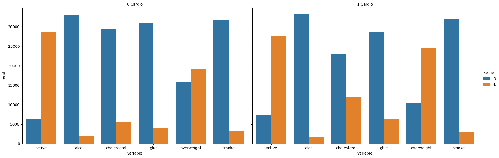
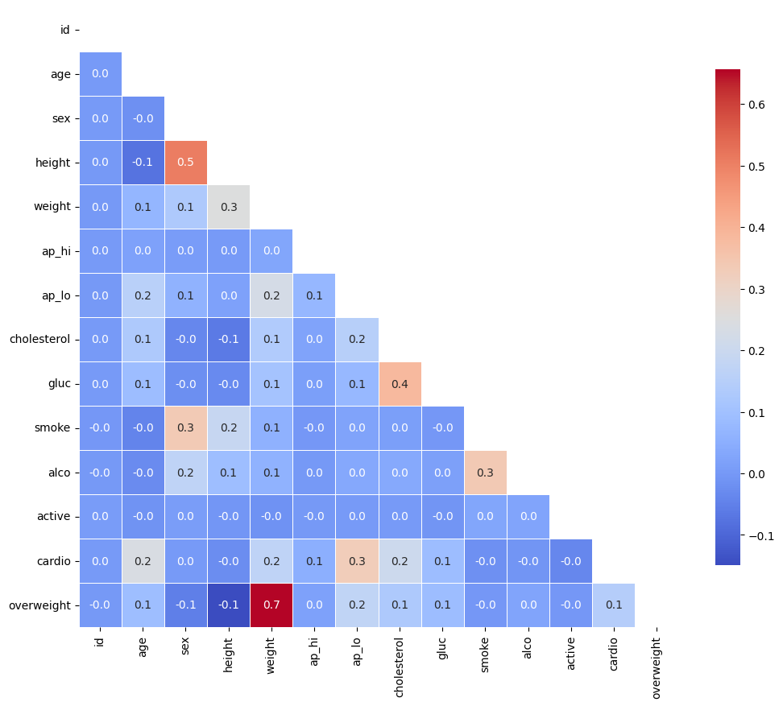

# Medical Data Visualizer 🩺📊

This project visualizes patient health data using Seaborn. It includes two key visualizations:
- **Categorical Plot** comparing lifestyle and medical indicators for people with and without cardiovascular disease
- **Heatmap** showing correlations between health features after filtering outliers

## 📁 Files

- `medical_data_visualizer.ipynb`: Main script with visualization
- `categorical_plot.png`: Output bar plot of normalized health metrics
- `heatmap.png`: Correlation matrix heatmap of filtered data
- `medical_examination.csv`: Dataset used (you can replace it with your own if needed)

